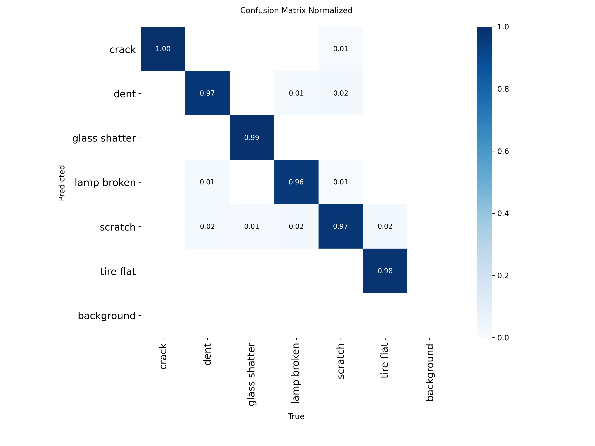
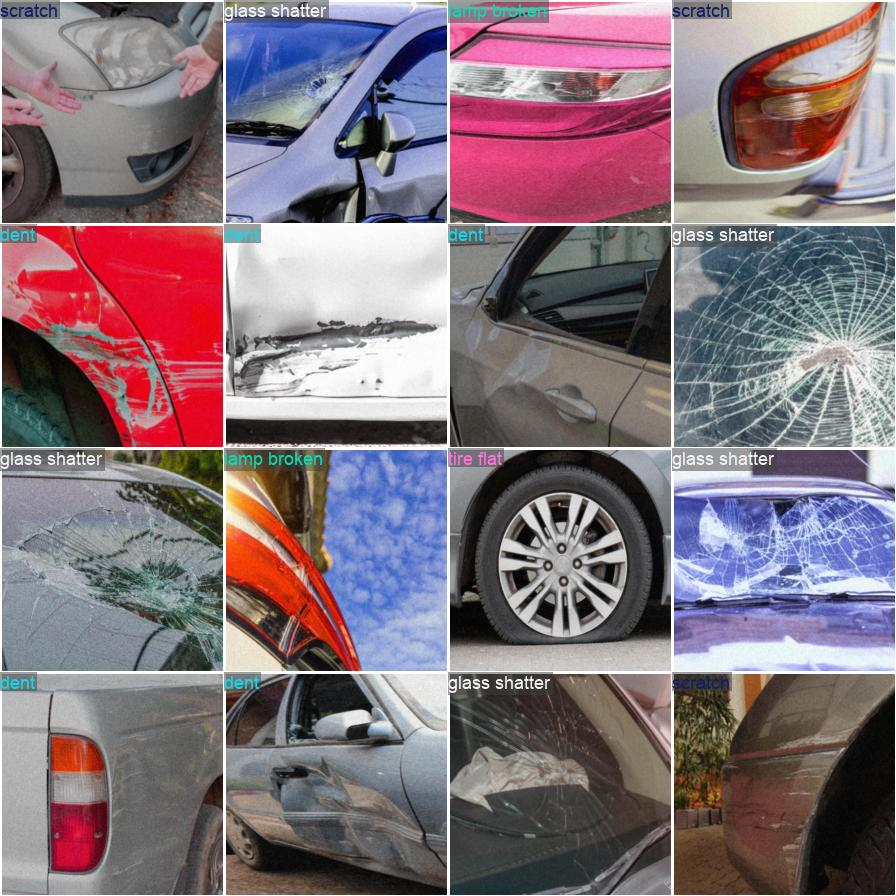
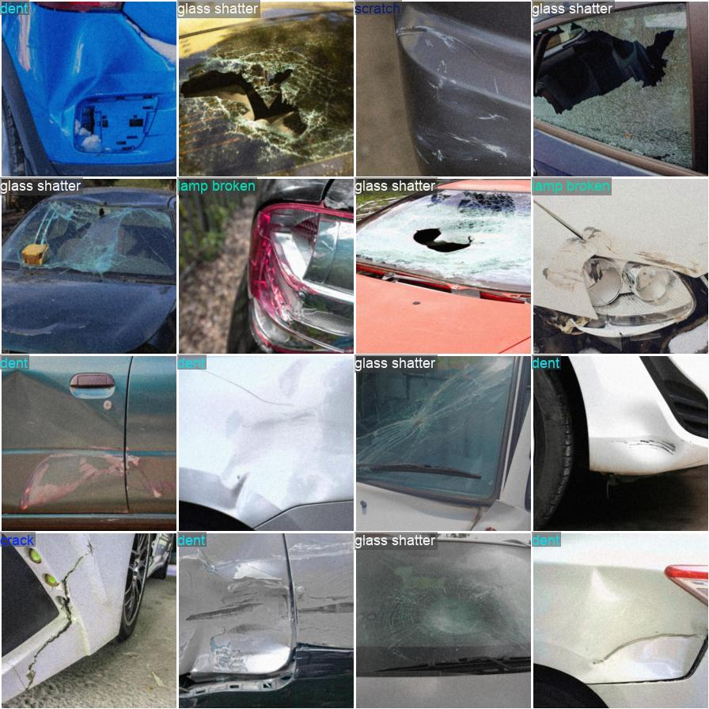

# **Trabalho da Unidade III – Visão Computacional 2025.1**

**Projeto:** Sistema de Classificação de Danos em Veículos Utilizando YOLO  
**Autor:** Gabriel Rossine Paulino de Souza  
**Repositório:** [GitHub](https://github.com/Kirishimya/VehicleDamageCls)

---

## **1. Introdução**

A avaliação de danos em veículos é um processo fundamental em diversos setores – seguradoras, oficinas mecânicas, locadoras etc. Tradicionalmente, um inspetor faz essa análise manualmente, tornando-a lenta, subjetiva e custosa. Nosso objetivo foi automatizar essa tarefa com visão computacional, classificando imagens de veículos em **seis** tipos de avarias:

- **crack** (rachadura)  
- **dent** (amassado)  
- **glass shatter** (vidro quebrado)  
- **lamp broken** (farol danificado)  
- **scratch** (arranhão)  
- **tire flat** (pneu furado)  

Usamos um modelo da família YOLO (You Only Look Once) pré‑treinado e afinado para reconhecer esses padrões.

---

## **2. Desenvolvimento e Técnicas Utilizadas**

### 2.1. Dataset

- Conjunto público do Kaggle com milhares de imagens rotuladas nas 6 classes.  
- Divisão por `split-folders`: **80%** treinamento | **20%** validação.

### 2.2. Modelo de Classificação

- **Ultralytics YOLOv8**  
- **Transfer Learning** a partir de pesos pré‑treinados no ImageNet.  
- Fine‑tuning por **10 épocas**, equilíbrio entre aprendizagem e generalização.

### 2.3. Ambiente e Treinamento

- **Google Colab** (GPU)  
- **Python 3**, **PyTorch**, **Ultralytics YOLO**  
- Notebook: `CVAv3.ipynb`

---

## **3. Resultados**

### 3.1. Métricas de Desempenho

- **Acurácia (validação): 97,5%**

all 0.975 1
Speed: 0.0ms preprocess, 22.3ms inference, 0.0ms loss, 0.0ms postprocess per image

ruby
Copy
Edit

### 3.2. Matriz de Confusão

**Análise (normalizada por linha):**

| Classe real       | Crack | Dent | GS    | LB    | Scratch | TF    |
|-------------------|:-----:|:----:|:-----:|:-----:|:-------:|:-----:|
| **crack**         | 1.00  |  —   |  —    | 0.01  |   —     |   —   |
| **dent**          |  —    | 0.97 |  —    | 0.01  |  0.02   |   —   |
| **glass shatter** |  —    |  —   | 0.99  |  —    |   —     |   —   |
| **lamp broken**   |  —    | 0.01 |  —    | 0.96  |  0.01   |   —   |
| **scratch**       | 0.02  | 0.01 | 0.02  |  —    |  0.97   | 0.02  |
| **tire flat**     | 0.01  |  —   |  —    |  —    |   —     | 0.98  |

- **Melhor desempenho:** _crack_ e _glass shatter_.  
- **Confusões chave:** _dent_ ↔ _scratch_; _lamp broken_ confundido com _dent_; _scratch_ às vezes como _tire flat_.

### 3.3. Análise Qualitativa

Comparação entre rótulos verdadeiros (branco) e previsões (cores):

#### Lote 0

| Rótulos Reais                         | Previsões do Modelo                        |
|---------------------------------------|--------------------------------------------|
|  |  |

- **Acertos:** trincas e vidros quebrados sempre corretos.  
- **Erros:** amassado leve classificado como _glass shatter_; leve dano no farol como _lamp broken_.

#### Lote 1

| Rótulos Reais                         | Previsões do Modelo                        |
|---------------------------------------|--------------------------------------------|
|  |  |

- **Acertos:** pneus furados e arranhões profundos.  
- **Erros:** impacto leve no farol marcado como _glass shatter_; amassado complexo com confiança menor (0.85).

---

## **4. Conclusão**

- YOLOv8 atingiu **97,5%** de acurácia em 6 classes de dano automotivo.  
- **Futuros trabalhos:**  
  1. Detecção com bounding‑boxes.  
  2. Classificação de severidade (leve/médio/grave).  
  3. Deploy em app web/móvel.
